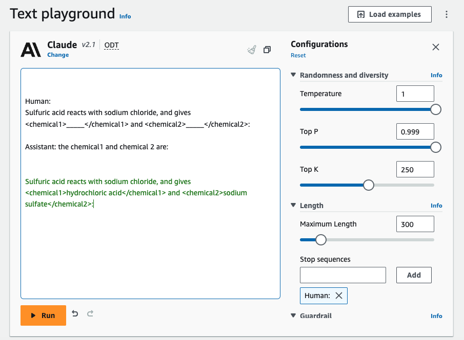
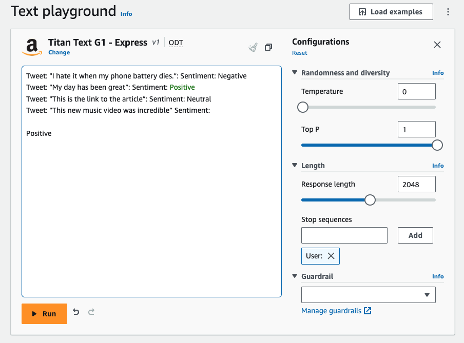

# Prompt Engineering

## Overview
Prompt engineering is an emerging discipline focused on developing optimized prompts to efficiently apply language models to various tasks. Prompt engineering helps researchers understand the abilities and limits of large language models (LLMs). By using various prompt engineering techniques, you can often get better answers from the foundation models without spending effort and cost on retraining or fine-tuning them.

Note that prompt engineering does not involve fine-tuning the model. In fine-tuning, the weights/parameters are adjusted using training data with the goal of optimizing a cost function. Model fine-tuning is generally an expensive process in terms of computation time and actual costs. Prompt engineering attempts to guide the trained foundation model (FM) to provide more relevant and accurate answers using various methods, such as, better worded questions, similar examples, intermediate steps, and logical reasoning.

Prompt Engineering leverages the principle of “priming”: providing the model with a context of few (3-5) examples of what the user expects the output to look like, so that the model mimics the previously “primed” behavior. By interacting with the LLM through a series of questions, statements, or instructions, users can effectively guide the LLM's understanding and adjust its behavior according to the specific context of the conversation.

In short, prompt engineering is a new and important field for optimizing how you apply, develop, and understand language models, especially large language models. At its core, it is about designing prompts and interactions to expand what language technologies can do, address their weaknesses, and gain insights into their functioning. Prompt engineering equips us with strategies and techniques for pushing the boundaries of what is possible with language models and their applications.


## Why is it relevant?
The key ideas are:

- Prompt engineering is the fastest way to harness the power of large language models.
- Prompt engineering optimizes how you work with and direct language models.
- It boosts abilities, improves safety, and provides understanding.
- Prompt engineering incorporates various skills for interfacing with and advancing language models.
- Prompt engineering enables new features like augmenting domain knowledge with language models without changing model parameters or fine-tuning.
- Prompt engineering provides methods for interacting with, building with, and grasping language models' capabilities.
- Higher quality prompt inputs lead to higher quality outputs.
In this guide, you will focus on best practices for prompt engineering with several models in Bedrock, including Amazon Titan models and third party models provided by Anthropic and Mistral AI.

## Structure of a prompt
As you explore prompt engineering examples, note that each prompt contains:

- Instructions: A task for the model to do. (Task description or instruction on how the model should perform)
- Context: External information to guide the model.
- Input data: The input you want a response for.
- Output indicator: The output type or format.
Prompts don't require all four elements. Their structure depends on the task. You'll go through some examples soon.


With experimentation, you'll gain intuition for crafting and optimizing prompts to best suit your needs and models. Prompt engineering is an iterative skill that improves with practice.


## Prompt Engineering Patterns
### Zero-Shot
Zero Shot prompting describes the technique where you present a task to an LLM without giving it further examples. You, therefore, expect it to perform the task without getting a prior look at a “shot” at the task, hence the name “zero-shot” prompting.

Modern LLMs demonstrate remarkable zero-shot performance, and a positive correlation can be drawn between model size and zero-shot performance.

```
Human:
Sulfuric acid reacts with sodium chloride, and gives <chemical1>_____</chemical1> and <chemical2>_____</chemical2>:
Assistant: the chemical1 and chemical 2 are:

```
Example executed on Amazon Bedrock text playground, with Anthropic Claude model:



## Few-Shot
Giving the model more information about the tasks at hand via examples is called Few-Shot Prompting. It can be used for in-context learning by providing examples of the task and the desired output. You can therefore condition the model on the examples to follow the task guidance more closely.

```
Tweet: "I hate it when my phone battery dies.”: Sentiment: Negative
Tweet: "My day has been great”: Sentiment: Positive
Tweet: "This is the link to the article”: Sentiment: Neutral
Tweet: "This new music video was incredible” Sentiment:

```
Example executed in the Amazon Bedrock text playground, using the Amazon Titan model.



## Chain-of-Thought (with Few-Shot)
Chain-of-Thought (CoT) prompting breaks down complex reasoning tasks through intermediary reasoning steps. Chain-of-Thought prompts are usually very specific to a problem type. One can try to invoke CoT reasoning by using the trigger phrase "(Think Step-by-Step)". Let's examine the following example of a few-shot CoT prompt.

#### Hint: You can test following prompt in Amazon Bedrock text playground with distinct models

```

On a given week, the viewers for a TV channel were
Monday: 6500 viewers
Tuesday: 6400 viewers
Wednesday: 6300 viewers


Question: How many viewers can we expect on Friday?
Answer: Based on the numbers given and without any more information, there is a daily decrease of 100 viewers. If we assume this trend will continue during the following days, we can expect 6200 viewers on the next day that would be Thursday, and therefore 6100 viewers on the next day that would be Friday.


Question: How many viewers can we expect on Saturday? (Think Step-by-Step)
Answer:

```
Answer provided by Anthropic Claude model:

```
Here are the step-by-step workings:

1. Monday viewers: 6500
2. Tuesday viewers: 6400 (decrease of 100 from Monday)
3. Wednesday viewers: 6300 (decrease of 100 from Tuesday)

We see a daily decrease of 100 viewers from the previous day.

4. Following the trend, Thursday viewers: 6200 (decrease of 100 from Wednesday)
5. Friday viewers: 6100 (decrease of 100 from Thursday)
6. For Saturday, we continue the decreasing trend and subtract another 100 viewers from Friday:

Saturday viewers: 6000 (decrease of 100 from 6100 on Friday)
So based on the decreasing trend of 100 viewers per day, we can estimate 6000 viewers on Saturday.
The step-by-step workings are:

Monday: 6500
Tuesday: 6400  (6500 - 100)
Wednesday: 6300 (6400 - 100)
Thursday: 6200 (6300 - 100)
Friday: 6100 (6200 - 100)
Saturday: 6000 (6100 - 100)

Does this make sense? Let me know if you need any clarification.

```

## Conclusion

You have learned examples of how to engineer prompts to get better results from models. These examples are just a few of the options that prompt engineering can provide. You can test other options in the Amazon Bedrock text playground.
