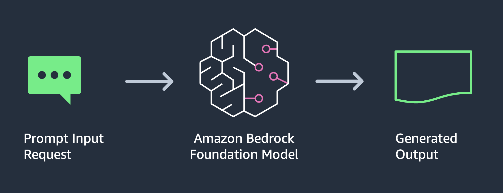

# Text Generation
## Overview
In this lab, you will learn how to generate text using LLMs on Amazon Bedrock. We will demonstrate the use of LLMs to showcase open-ended text generation and entity extraction use-cases. These examples leverage boto3 api calls. For open source implementations refer to the OpenSource Examples

To continue supporting best practices in the responsible use of AI, Titan FMs are built to detect and remove harmful content in the data, reject inappropriate content in the user input, and filter the models’ outputs that contain inappropriate content (such as hate speech, profanity, and violence).

AWS offers Amazon Titan and select third-party models in Bedrock. The large language models (LLMs) can be used for tasks such as text generation (e.g. e-mail generation, short stories, essays, social media posts, and web page copy).

<b>Entity Extraction</b> Classic entity extraction programs usually limit you to pre-defined classes, such as name, address, price, etc. or require you to provide many examples of types of entities you are interested in. By using an LLM for entity extraction, in most cases you only need to specify what you want to extract in natural language. This gives you flexibility and accuracy in your queries while saving time by removing the necessity of data labeling. In this module, you will be able to work with the Amazon Bedrock API to extract entities based on simple descriptions.

## Relevance
Generating text using large language models results in productivity gains. For example, marketing teams can create an ad copy in minutes using natural language instructions.

## Target audience
Architects, data scientists, and developer who want to learn how to use Amazon Bedrock LLMs to generate text. Some of the business use cases for text generation include:

- Marketing teams - Product descriptions based on data about its features and benefits, social media posts.
- Media - Automated article generation, Campaigns.
- All business units - Email generation, report generation.
- Code Translation, Code explain and reviews
- Entity extraction

## Challenges
Generated text can be generic, lacking context, and contain hallucination, which happens when the model generates text output that doesn't correspond with the sent prompt.

## Architecture
The approach will leverage Bedrock native APIs using the Boto3 SDK. We will demonstrate several patterns with this lab which are detailed below. At a high level the flow of prompt and data can be represented by the diagram below

## Sub-patterns
There are five sub-patterns that will be demonstrated on this module for text generation:

  - With zero-shot generation, the user will only provide an input request to generate an email without any context. We will explore zero-shot email generation using two approaches: Bedrock API (Boto3) and Bedrock integration with LangChain.

[Code generation](src/01_Text_generation/01_code_generation_w_bedrock.ipynb)  - With zero-shot generation we can leverage the code generation capability of the model. This is based on the data learnt by the model during training.

[Summarization](src/01_Text_generation/02_text-summarization-titan+claude.ipynb)  - In this sub-pattern, we will explore the summarization capability and leverage the Titan model for the same. This approach is dependent on the size of the document and the context length. Later on we will explore other patterns to summarize larger documents.

[Simplified Question Answering](src/01_Text_generation/03_qa_with_bedrock_titan.ipynb)  - The example will show how questions are sent to the model and will get answers from the base model with no modifications. Question Answering (QA) is an important task that involves extracting answers to factual queries posed in natural language. Typically, a QA system processes a query against a knowledge base containing structured or unstructured data and generates a response with accurate information. Ensuring high accuracy is key to developing a useful, reliable and trustworthy question answering system, especially for enterprise use cases.

[Entity Extraction](src/01_Text_generation/04_entity_extraction.ipynb)   - In this sub-pattern, we will Entity extraction is an NLP technique that allows us to automatically extract specific data from naturally written text, such as news, emails, books, etc. That data can then later be saved to a database, used for lookup or any other type of processing.

